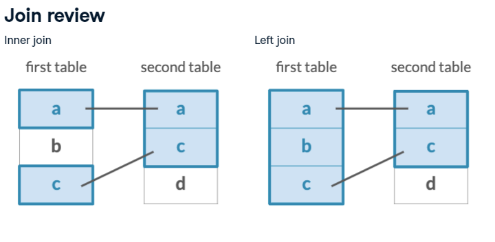

```{r setup, include=FALSE}
knitr::opts_chunk$set(echo = TRUE, eval = TRUE, 
                      message=FALSE, warning=FALSE,
                      results = 'hide')
```


```{r libraries import, class.source = "fold-hide"}
library(here)
library(tidyverse)
library(RSQLite)
```


# Working with data from SQLite database in R

## Finding where WHONET database is stored

The data you will have registered in WHONET software are stored in a SQLite database.
It is possible to have different databases in WHONET, depending on which 
laboratory you are working with.

<!-- We need to have WHONET lesson before this course --> 

If you installed WHONET program using the default settings, you should will find 
the test database in the following path: `C:/WHONET/Data`. Please check that
you find the test database where you registred the data. 
If you registred the database in another directory, please note the path 
(eg. use the file explorer program to find the file, and copy the path as text)


The path I copied is `C:\WHONET` and the my test database is called `WHO-TST-2020-OneHealth.sqlite` (the extension is explicit here).

I first need to check if I manage to read the directory that contains the 
database in R and find the database file. 


- listing files in a directory (testing path of directory, and if I can see the
database file)

> Note: I using variable name that are explicit and descriptive of the content. 
This helps making the code more readeable. I am not afrraid of using long names, 
as I can use tab completion in RStudio to avoid typing long names. 

> Note: the path in a linux system can be written a bit differently. 


```{r}
whonet_data_path <- "C:/WHONET/Data"
list.files(whonet_data_path)
```


## Working with a SQLite database in R

We will use the packages `RSQLite` and `dbplyr` (a part of the tidyverse) to work with
SQLite databases. `RSQLite` is a package that allows R to connect to SQLite databases
and `dbplyr` is a package that allows to send instructions (queries) to the 
SQLite database using dplyr language that you learned during last lesson. 
In other words, dbplyr translates the query you write in R using dbplyr 
language into a SQL query language. 


To be able to read the data that are collected in the database, we need to create
a connection to the database. You can see this as a bridge between the database
and R memory, allowing information to circulate from (and to) the database to R.

> Note: We won't show you how to write back data in the SQLite database. 
We do not want that because we do not want you to modify the raw data. But it is
totally possible to create another database or another table to contain the 
cleaned data. Moreover, these are more delicate operations can lead to data loss
if errors are done. So we do not advice you to ever try, unless you work on a backup
of your data. 


### Creating a connection to the sqlite database

```{r}
# dbConnect - is an imported function from DBI
dbconn <- dbConnect(RSQLite::SQLite(), 
                    here::here(whonet_data_path, "TZA-INIKA_TZ-2024.sqlite"))

str(dbconn)

print(dbconn)
```
> dbconn is not the data contained in the database, but a way to access the 
information contained in the database file.

Note: look how the path of the file is represented here. If you one day get 
problem with reading files in R from windows, this is how you have to treat the
paths, using `\\` instead of `/`.


### Obtaining the list of tables (dataframes) contained in the database


```{r}
dbListTables(dbconn)
```

The data you have registered is in the `Isolates` table.


### Obtaining data from a table of the database

Database are very convenient to store large amount of data, an amount of data
that would not fit in the memory of your computer. 

There are then two ways to work with the data: 

- sending all the data in R memory and then working on selecting and filtering the data you need to answer the research question you are interested in. However, when the amount
of data is large, it might not be possible to do so with a normal computer with limited memory. This can lead to the computer crashing, or the R session being killed. 
- sending instructions to the database to select and filter the data directly in the database, and only send the data that you need in R memory. This is what we will do here. 
This is possible due to the `dbplyr` package that allows **lazy evaluation** of 
instructions, meaning that instructions are evaluated only when needed[^1]. This 
allows to reduce memory usage by only getting the data into memory when it is needed:
- eg. when using collect() function, which pulls the data from the database into R memory. 
- eg. when requesting to View the data resulting from a query. 
Otherwise, the code is equivalent to storing the instructions (I call that the blueprint)
on how to do things without doing them[^2]. 


<!-- This will appear at the end of the webpage -->
[^1]: This is a rather complicated concept that I feel I still not master totally.
You can read [here](https://www.r-bloggers.com/2018/07/about-lazy-evaluation/).

[^2]: You can view that as `cake <- bake(cake_recipe)`. The cake_recipe is the blueprint, and the cake is the result of the baking. However the cake is only baked when you want to use it
for something eg. `collect(cake)` which is equivalent to make (`eval`) the cake now!.


- We will use the `tbl()` function from the `dbplyr` package, this will allow 
to read the data from the database... but there is a small quirk 

```{r}
isolates_tbl <- tbl(dbconn, "Isolates")
```

### Distinction lazy evaluation and evaluation

- `isolates_tbl` object contains the instructions (query) that will be sent to 
the database when we ask for the data.
```{r}
# This is the blueprint
str(isolates_tbl)
View(isolates_tbl) # Query not evaluated evaluated 
```
This gives you the source of the connection and the query that is sent to the table 


- glimpse function that we already have seen here show a different result, it actually
is evaluated and thus gives you an overview of the data obtained after sending the
query to the database.
```{r}
glimpse(isolates_tbl)
head(isolates_tbl)
```

- you can see the query that is actually sent to the database using: 
```{r}
show_query(isolates_tbl)
```
This is the translation of the query to the SQL language.
 
This means that you can now see the results of the query directly with show: 
```{r}
View(isolates_tbl %>% collect())
```

Lets look at the description of the collect function
```{r}
?collect 
```

**Force computation = force evaluation.** The query instructions are sent to the 
SQL database and the data are sent back to R. When you assign the data that
is sent back to an object, this object containing the data is then in R memory.
This becomes equivalent to working on a data frame that we read into an R object from
a spreadsheet. 

> PS: a tibble is a data frame created by the tibble R package (its a data frame format).
You do not need to bother about that here. 


```{r}
isolates_df <- collect(isolates_tbl)
str(isolates_df)
glimpse(isolates_df)
head(isolates_df)
```

### We used R memory for nothing : freeing some memory (if we have time)

Because we expect your data to be quite large, we would like to minimize memory usage,
so your computer continues to function optimally.

But for demonstration purpose, we have created a data frame `isolate_df` that is stored
in R memory. We want among other to remove this object from memory.

Note: In the environment panel, there is a little disc showing how much memory is used.


#### A bit of understanding of memory 

- Lets create two more object for demonstration purpose 

```{r}
dummy_a <- 10
dummy_b <- isolates_df
```


- listing the object in the environment
```{r}
ls()
```

- [ ]  Compare this to the objects listed in the environment panel

Did we made an identical copy of the data frame or does it point towards the
same place in the memory ? (for people who know about python, is this an hard 
copy?)

```{r}
isolates_df == dummy_b
# This is more practical 
all.equal(isolates_df, dummy_b) 
identical(isolates_df, dummy_b)

identical(isolates_df, dummy_b, ignore.bytecode = FALSE)
```

- [ ]  Read about how R compare objects [Identical function](https://rdrr.io/r/base/identical.html) and [memory and pointers](https://nonvalet.com/posts/20220316_memory_and_pointers_r/)


```{r}
dummy_c <- dummy_b
identical(dummy_b, dummy_c)
# does it modify the original object or create a copy ?
```

The objects point to the same memory, but when we reassign a modified object
then the memory location becomes different, and thus independent of the object
it was originally copied from. This is good, but then it also mean that if you
at each step creates copies of a modified object you can soon run out of memory. 

```{r}
dummy_c <- dummy_c %>% filter(PATIENT_ID == "231")
identical(dummy_b, dummy_c) # the objects are now different
```

#### Freeing memory

```{r}
ls() # listing objects

```

We want to remove only one object 
```{r}
rm(dummy_a)

ls()
```

We can see that the object has been removed from the environment. 
We want to remove several other objects:  "isolates_df, dummy_b" and dummy_c if 
you did the exercise above. 
We can do that using a vector of object
```{r}
dput(ls()) # a trick to allow creating a vector you can copy and edit

# I copy and edit the result
rm(list = c("dummy_b", "dummy_c", "isolates_df"))
ls()
```

The objects are not in the memory anymore. 

### Selecting and filtering data by sending instructions to the database. 

We can generally use the same verbs (aka functions[^3]) as in we learned in dplyr 
to filter and select data from a SQLite database using dbplyr. 

> Note that however not all dplyr verbs are available in dbplyr. 
This might be due to the fact that some dplyr functionalities cannot be directly 
translated into SQL queries. See here to see the functions that work in [dbplyr](https://dbplyr.tidyverse.org/articles/dbplyr.html)

[^3]: people call the dplyr functions verbs. Honestly I am not sure about why this
distinction is made for ... but this is a term that can be found in the documentation
and useful to know to allow get better results for our searches 


```{r}
isolates_tbl %>% collect() %>% View()
colnames(isolates_tbl)
```

```{r}
buidling_query <- 
  isolates_tbl %>% 
  # This allow to remove columns from the data
  select(-ROW_IDX, -LAST_NAME, -FIRST_NAME) 

show_query(buidling_query)
```
This is still a query building 


```{r}
buidling_query <- 
 buidling_query %>%
  filter(ORIGIN == "h") 
  
show_query(buidling_query)
```

Great - now I have filtered the data I wanted, the human data 
```{r}
human_lab_data <- 
  buidling_query %>%
  collect()

View(human_lab_data)
```

Now I can get the portion of the data I am interested to work with into memory 

# Joining tables - the different kind of joints. 

We need to combine information from two data sets. We use the test data that
you entered in WHONET and the human data for questionnaires we have used yesterday
to learn how to prepare data for analysis as an example. 


## Importing the human data that was saved in an rds file. 

We need to re-import the data we saved in the previous session. 

```{r}
human_question_data <- readRDS(here::here("results", "human_data_selection_dedup.rds")) 
```


## Different types of joints 

dplyr allow to create joints between data frames.

---

{width=50%}


{width=50%}

</br>

---

Be careful, if you ID (or key that you use to join data is not unique, this will create 
all combination of joins). Therefore each observation (row) in each data set has to be uniquely identified, and all the columns necessary to this unique identification
need to be present in the dataset we want to join. 

Discussion: 

- [ ]  What is the difference between the different types of joins ?
- [ ]  The problem of IDs that are not unique. 


> You can read about how to [join data using dplyr here](https://rpubs.com/odenipinedo/joining-data-with-dplyr) and [here](https://tavareshugo.github.io/r-intro-tidyverse-gapminder/08-joins/index.html). 
Those links are the source of the 2 images above. 

```{r}
# will also give you the information about the other mutating joints
?left_join 
```


## Combining different data frames using mutating joints 

- Finding which columns are common to the two data frames : if they are not named
identically you need to compare those yourself
```{r}
colnames(human_question_data)
colnames(human_lab_data)
```

- inner_join allows to select only the data that are observations that 
are matching in both tables 

```{r}
my_innerjoin <- 
  human_question_data %>% 
  # selecting few columns for testing
  #  this can be used to do a short selection of the columns if not all are required
  # select(1:3) %>% 
  dplyr::inner_join(human_lab_data, by = c("INIKA_OH_TZ_ID" = "PATIENT_ID")) 

my_innerjoin %>%
  View()
```


- anti-join is very practical because it allows you to find the observations
that are not matched. It can allow you to find out if the proper data are excluded
from the join

```{r, message=TRUE}
colnames(my_innerjoin)

my_innerjoin %>%
  # the joint is done using ALL columns that are named identically in both tables
  anti_join(human_question_data) 

# Oops 
# I used the wrong order ! 
# because my_inner join will contain a subset of the general data 
            
human_question_data %>%
  # the joint is done using ALL columns that are named identically in both tables
  anti_join(my_innerjoin) 
```

This shows all the data in human_question_data that are not in my_inner join.
The message also gives you information about which columns were used to create the
join 


## Verifying that the data is consistent (if time - same principle as Yesterday)

This allows you both to detect if the common data that has been registered in
the two different tables is consistent, thus allowing to check further the 
quality of your data and to filter out unreliable data. 

```{r}
colnames(my_innerjoin)
```

Here I see that the data in `"Age__yrs" should correspond to the data in 
column. Similarly The data in the "Gender" column should correspond to the data
in "SEX". Moreover, it should be possible to retrieve the data from "AGE" from the
"DATE_BIRTH" and the date to which the data has been collected if its correct inside ... 


We will test the consistence of the data in a subset to make it easier to check 
```{r}
my_innerjoin %>%
  select(1:3, AGE, SEX) %>%
  head()

```


How hell the data is not complete. 
We do as if it was. 

> Warning: to see if the data is coherent, the types of the data must be identical
or the test of equality must account for this 

```{r}
my_innerjoin %>%
  select(1:3, AGE, SEX) %>%
  # another way to write one variable
  mutate_at(.vars = "AGE", as.integer) %>%
  mutate_at(.vars = "Gender", as.character) %>%
  # This allows to test without changing the data - but if you have many different
  # categories it is better to recode the data 
  mutate(SAME_AGE = if_else(!is.na(AGE) & Age__yrs == AGE , "inconsistent" , "missing"),
         SAME_SEX = case_when(
           Gender == "Male" & SEX == "M" ~ "ok",
           Gender == "Female" & SEX == "F"~ "ok",
           SEX == "" ~  "missing",
           TRUE ~ "inconsistent")
         ) 

```


# Plotting data 
> import data from Janice and look at the plots 

## Matching WHONET plots 

## Other plots ?
- [ ] Madelaine 

## Some stats ? 
- [ ] Madelaine 
I doubt that we will go that far ... but they can use that on their own ...


# Tricks

- `?tidyselect::select_helpers` to see the ways to select columns more efficiently
using helpers like `starts_with`, `ends_with`, `contains`, `matches`, `one_of`, `num_range`

- Use the course material in `Rmarkdown`, you can copy the examples of formating
and adapt the course material to your need. 


# When you are ready to go further:


- Working with SQLite database without and with R: [Databases and SQL course](https://swcarpentry.github.io/sql-novice-survey/index.html)
- [dbplyr vignette](https://dbplyr.tidyverse.org/articles/dbplyr.html)
- [programming in the tidyverse](https://krlmlr.github.io/tidyprog/index.html)
  particularly the chapter about tidy evaluation should be usefull


## Other ressources that I either used or look at and found if could be useful for you one day
- [SQL query order of execution](https://www.sisense.com/blog/sql-query-order-of-operations/)
- [Lazy evaluation and lazy queries](https://smithjd.github.io/sql-pet/chapter-lazy-evaluation-queries.html)

- for programming with dplyr : read about 
  - tidy evaluation 
  - non standard evaluation
  - injection 

- [Advanced R](https://adv-r.hadley.nz/index.html)
<!-- 

- injection  ? vs lazy evaluation ?  
  
rlang : [qq_show](https://rlang.r-lib.org/reference/qq_show.html) 
      

- should you learn to make functions using dbplyr, [this](https://dbplyr.tidyverse.org/articles/dbplyr.html) could be of help

[tidy evaluation](https://brad-cannell.github.io/r_notes/tidy-evaluation.html)
[and](https://krlmlr.github.io/tidyprog/tidy-evaluation.html)
--> 
