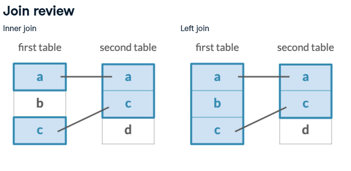

```{r setup, include=FALSE}
knitr::opts_chunk$set(echo = TRUE, eval = TRUE, 
                      message=FALSE, warning=FALSE,
                      results = 'hide')
```

```{r libraries import, class.source = "fold-hide"}
library(here)
library(tidyverse)
library(RSQLite)
```

# Working with data from SQLite database in R

## Finding where WHONET database is stored

The data you will have registered in WHONET software is stored in a
SQLite database. It is possible to have different databases in WHONET,
depending on which laboratory you are working with.

<!-- We need to have WHONET lesson before this course -->

If you installed WHONET program using the default settings, you should
will find the databases that are created in the following path:
`C:/WHONET/Data`. Please check that you find the test database that was
used for the data registering exercise. If you saved the database in
another directory, please take note the path where you saved it (eg. use
the file explorer program to find the file, and copy the path as text)

The path I copied is `C:\WHONET` and the my test database is called
`WHO-TST-2020-OneHealth.sqlite` (the extension is explicit here).

I first need to check if I can explore the directory that should contain
the database and list the files that are contained in this directory
using R. (This serves as test for accessing paths and files in windows
system via R - as this access might depend upon the permissions you have
on the computer).

### Listing files in a directory

Note: I using **variable names** that are explicit and descriptive of
what the variable represents/contains. This contributes to making the
code readable and understandable by other people. I am not afraid of
using long names, as I can use tab completion in RStudio to avoid to
type long names.

```{r}
whonet_data_path <- "C:/WHONET/Data"
list.files(whonet_data_path)
```

## Using data directly from a SQLite database

We will use the packages `RSQLite` and `dbplyr` (a part of the tidyverse
meta package) to work with SQLite databases.

`RSQLite` is a package that allows R to connect to SQLite databases.
`dbplyr` is a package that allows to send instructions (queries) to the
SQLite database using `dplyr` language/functions. You learn dplyr during
last lesson, this is very convenient !. In other words, `dbplyr`
translates the instructions you write into a SQLite query.

To be able to read the data stored in the SQLite database, we need to
create a connection to the database. You can see a connection as a
bridge between the database and R, allowing information to flow between
(from and to) the database and R (Rstudio).

> Note: We won't show you how to write back data in the SQLite database.
> We do not want any update of the raw data - we do not modify raw data.
> (But it is totally possible to do so. It is also possible to create
> another database or another table to contain the cleaned data.)

### Creating a connection to the sqlite database

```{r}
dbconn <- DBI::dbConnect(RSQLite::SQLite(), 
                    here::here(whonet_data_path, "TZA-INIKA_TZ-2024.sqlite"))

str(dbconn)
print(dbconn)
```

> dbconn is not the data contained in the database, but a connection,
> that will allow to retrive the information contained in the database.

Note: look how the path of the file is represented here. If you, one day
get problems with reading files in R from windows, you might have 
to adjust how the paths are written: using `\\` instead of `/`. 
Its eg. because windows and linux have slightly different ways to encode paths.

### Obtaining the list of tables (dataframes) contained in the database

```{r}
dbListTables(dbconn)
```

The data you have registered is contained in the `Isolates` table.

### Reading the data from a table (in an SQLite database)

Databases are very convenient to store large amount of data. An amount of
data that would not fit in the memory of your computer. 

There are then two ways to work with the data contained in the
database:

-   send all the data in R memory and then work on selecting and
    filtering what you need to answer the research question(s) you are
    interested in. This is problematic when the amount of data are large, as 
    it might  not be possible to do so with a normal computer with relatively 
    little RAM. (eg. the computer might crash, and/or the R session can me 
    killed). Consequently, working as such might not be possible at all. 
    
-   send instructions (queries) to the database, to select, filter and work with 
    the data as much as possible before getting the data in R memory. 
    This is what we will try to do here. 
    This is possible because the  `dbplyr` package allows **lazy evaluation** of 
    instructions. This means that instructions are evaluated only when needed[^1]. 
    It allows to reduce memory usage by only getting the data into memory
    when it is needed. 
    -   eg. when using collect() function, which pulls the data from the
    database into R memory.
    -   eg. when requesting to View the data resulting from a query.
    Otherwise, the code is equivalent to storing the instructions (I
    call that the blueprint) on how to do things without doing them[^2].

[^1]: This is a rather complicated concept that I feel I still not
    master totally. You can read
    [here](https://www.r-bloggers.com/2018/07/about-lazy-evaluation/).

[^2]: You can view that as `cake <- bake(cake_recipe)`. The cake_recipe
    is the blueprint, and the cake is the result of the baking. However
    the cake is only baked when you want to use it for something eg.
    `collect(cake)` which is equivalent to make (`eval`) the cake now!.
    
Eval (Evaluation) = force computation 

<!-- This will appear at the end of the webpage -->

-   We will use the `tbl()` function from the `dbplyr` package, this
    will allow to read the data from the database... but there is a
    small quirk

```{r}
isolates_tbl <- tbl(dbconn, "Isolates")
```

### Distinction lazy evaluation and evaluation

-   `isolates_tbl` object contains the instructions (query) that will be
    sent to the database when we ask for the data.

```{r}
# This is the blueprint
str(isolates_tbl)
View(isolates_tbl) # Query not evaluated evaluated 
```

This gives you the source of the connection and the query that is sent
to the table

-   glimpse function,  that we already have seen, gives you a different
    result. The query is actually evaluated and thus gives you an overview of
    the data obtained after sending the query to the database.

```{r}
glimpse(isolates_tbl)
head(isolates_tbl)
```

-   you can see the query that is actually sent to the database using:

```{r}
show_query(isolates_tbl)
```

This is the translation of the query to the SQL (SQLite) language.

You can also see the results of the query directly with show if you request 
evaluation of the query by using the collect function. 

```{r}
View(isolates_tbl %>% collect())
```

Lets look at the description of the collect function

```{r}
?collect 
```

**Force computation = force evaluation.** The query instructions are
sent to the SQLite database and the data are sent back to R. When you
assign the data that are sent back to an object, the object uses R memory. 
This becomes equivalent to working on a data frame that we read into an R object
directly from a spreadsheet.

> PS: a tibble is a data frame created by the tibble R package (its a
> data frame format that has been optimized for efficiency). 
You do not need to bother about details of data frame formats at this stage.

```{r}
isolates_df <- collect(isolates_tbl)
str(isolates_df)
glimpse(isolates_df)
head(isolates_df)
```

### We used R memory for nothing : freeing some memory (if we have time)

It is possible to remove objects from R memory. You want to remove 
objects that you will not use again. This can be for example objects you used 
temporarily to help check your data, tests data sets, etc. Freeing memory might 
allow your computer to continue work optimally. Moreover, it can also contribute
to clarify what is really necessary for you to keep to do your task. 

> It has the same benefits as organizing and cleaning your desk. Keeping solely 
what is necessary might help you work better. 

For demonstration purpose, we have created a data frame `isolate_df`
that is stored in R memory. We actually do not need it to use memory. We want to
remove it from the memory (aka remove it from the Environment). 

Note: In the environment panel, there is a little disc showing how much
memory is used.

#### A bit of understanding of memory (optional)

-   Lets create two additional objects for demonstration purpose

```{r}
dummy_a <- 10
dummy_b <- isolates_df
```

-   listing the objects that are present in the environment

```{r}
ls()
```

-   [ ]  Compare this to the objects listed in the environment panel

Did we made an identical copy of the data frame or does it point towards
the same place in the memory ? (for people who know about python, is
this an hard copy?)

```{r}
isolates_df == dummy_b
# This is more practical 
all.equal(isolates_df, dummy_b) 
identical(isolates_df, dummy_b)

identical(isolates_df, dummy_b, ignore.bytecode = FALSE)
```

-   [ ]  Read about how R compare objects [Identical
    function](https://rdrr.io/r/base/identical.html) and [memory and
    pointers](https://nonvalet.com/posts/20220316_memory_and_pointers_r/)
    
-   [ ]  Optional : find out how to find the address in memory where objects are 
stored (This is starting to be really advanced !) - (We do not do during the course)

```{r}
dummy_c <- dummy_b
identical(dummy_b, dummy_c)
# does it modify the original object or create a copy ?
```

The objects point to the same memory address, BUT when we reassign a modified
object, the memory storage address becomes different. The reassigned object then
became independent of the original object it was originally copied from. 

This is good, but then it
also means that if you at each step creates copies of a modified object
you can use a lot of RAM you actually do not need

```{r}
dummy_c <- dummy_c %>% filter(PATIENT_ID == "231")
identical(dummy_b, dummy_c) # the objects are now different
```

#### Freeing memory

```{r}
ls() # listing objects
```

We want to remove only one object

```{r}
rm(dummy_a)

ls()
```

We can see that the object has been removed from the environment. We
want to remove several other objects: eg. "isolates_df, dummy_b" and dummy_c
if you did the exercise above. We can do that using a vector of objects

```{r}
# a trick to allow creating a formatted vector you can copy and edit
dput(ls()) 

# I copy and edit the result
rm(list = c("dummy_b", "dummy_c", "isolates_df"))
ls()
```

Success ! the objects are removed from memory.

### Selecting and filtering data by sending instructions to the database.

We can generally use the same verbs (aka functions[^3]) as in we learned
during the previous lesson (dplyr verbs) to filter and select data from a SQLite 
database.

[^3]: people call the dplyr functions verbs. This is because they are actions
you do on the data (AND the are part of R grammar for data manipulation - which
is like a language). 


> Note that however not all dplyr verbs can be translated by dbplyr to SQLite 
query. SQL queries have to remain simple to work. 
More advanced data transformations might not be possible via SQL query language. 
It means that in those case you have to get the data into memory before you can
do more complex data transformations. See example : 
> [dbplyr](https://dbplyr.tidyverse.org/articles/dbplyr.html)

Example: Try this with, and without collect to see the difference

```{r}
isolates_tbl %>% 
  # replace all empty by NA
  mutate_all(~na_if(., "")) %>%
  collect() %>%
  mutate_at(vars(AGE), 
            ~ case_when(
                stringr::str_detect(AGE, "m") ~ as.numeric(str_remove(AGE, "m"))/12,
                TRUE ~ as.numeric(AGE)
              )) 
```

#### Reminder : cleaning and checking the data

```{r}
isolates_tbl %>% 
  colnames()
```


```{r}
buidling_query <- 
  isolates_tbl %>% 
  # This allow to remove columns from the data that are not informative
  select(-ROW_IDX, -COUNTRY_A, -LABORATORY, -SPEC_TYPE, -SPEC_CODE, -ISOL_NUM,
         -ORG_TYPE, -COMMENT) %>%
  # Allows to rename colums by removing the prefix "X_"
  rename_with(~str_remove(., "X_")) %>%
  # I want to move the ID in the begining of the table 
  select(PATIENT_ID, INIKA_ID, SPEC_NUM, everything()) 
```


```{r}
show_query(buidling_query)
```

This is still a query building

#### Reminder : controlling data quality

We can make a little control of the data as we have I

```{r}
buidling_query %>% 
  colnames()

# ALL ids are identical 
buidling_query %>% 
  filter(PATIENT_ID != INIKA_ID) 

# a way to separate columns
buidling_query %>% 
  select(INIKA_ID, SPEC_NUM) %>%
  collect() %>%
  separate(SPEC_NUM, into = c("ID", "SPEC_NUM"), sep = "-") %>%
  # Then we can again create a verification that the IDs are identical 
  filter(INIKA_ID != ID) 
```

**Here you can see there was probably an error during data recording. The data
needs to be corrected or removed. 

#### Filtering data prior to joining tables

Is it necessary ? Well the answer is it depends.

> It is actually not necessary to filter the human data prior to join
> WHONET data to KoboToolbox human data, **as long as the INIKA_ID are
> unique and correct**, the join will be correct. Having filtered the
> data prior to joining can be useful as it can make it easier to see if
> what we are doing is correct and easier to detect mistakes and errors.


 - We can add elements to a query 
```{r}
buidling_query <- 
 buidling_query %>%
  filter(ORIGIN == "h") 
  
show_query(buidling_query)
```

The query to select solely the data I wanted (here human data) is ready. 
I can now execute the query and get the data into memory.


```{r}
human_lab_data <- 
  buidling_query %>%
  collect()

View(human_lab_data)
```


## Closing a connection

When you are finished working with the connection to the database, 
you should close it.

```{r}
DBI::dbDisconnect(dbconn)
dbconn # status is disconnected
```

Because the connection is closed, it is not possible anymore to access the
data in the database. 
```{r, eval=FALSE}
isolates_tbl
```


# Joining tables and the different kind of joints.

We need to combine information from two data sets. We use the test data
that you entered in WHONET and the human data (from KoboToolbox we have
used yesterday as an example to learn how to prepare data analysis).

## Importing the human data that was saved in an rds file.

We need to re-import the data we have saved in the previous session.

```{r}
human_question_data <- readRDS(
  here::here("results", "human_data_selection_dedup.rds")
  ) 
```

## Different types of joints

dplyr allow to create joints between data frames.

------------------------------------------------------------------------

{width="50%"}

{width="50%"}

</br>

------------------------------------------------------------------------

Be careful, if the ID (or key that you use to join the data sets are not unique,
it might create all combination of possible joins). 
**Therefore each observation (row) in each data set has to be uniquely identified**, 
and all the columns necessary to this unique identification need to be present in
the data set we want to joint and all those columns need to be used for the joint.


Find about the joins that are possible in dplyr : 
```{r}
# will also give you the information about the other mutating joints
?left_join 
# Filtering joins 
?anti_join 
```

You can also search the help using the following command : 
```{r}
??"mutating join"
help.search("filtering join")
```


Discussion:

-   [ ]  What is the difference between the different types of joins ?
-   [ ]  What is the problem of IDs that are not unique. How can you solve 
    this problem ?

> You can read about how to [join data using dplyr
> here](https://rpubs.com/odenipinedo/joining-data-with-dplyr) and
> [here](https://tavareshugo.github.io/r-intro-tidyverse-gapminder/08-joins/index.html).
> Those links are the source of the 2 images above.

## Combining different data frames using mutating joints

-   Finding which columns are common to the two data frames : if they
    are not named identically you need to compare those yourself and then
    specify during the joining operation which column should correspond to 
    which other column

```{r}
colnames(human_question_data)
colnames(human_lab_data)
```

-   inner_join allows to select only the data that are observations that
    are matching in both tables

```{r}
my_innerjoin <- 
  human_question_data %>% 
  # selecting few columns for testing
  #  this can be used to do a short selection of the columns if not all are required
  # select(1:3) %>% 
  dplyr::inner_join(human_lab_data, by = c("INIKA_OH_TZ_ID" = "PATIENT_ID")) 

my_innerjoin %>%
  str()
```

-   anti-join is very practical because it allows you to find the
    observations that are not matched, quiet helpful to find out if all the 
    data that was supposed to be joined actually was joined. 
    

```{r, message=TRUE}
colnames(my_innerjoin)

my_innerjoin %>%
  # the joint is done using ALL columns that are named identically in both tables
  anti_join(human_question_data) 

# Oops 
# I used the wrong order ! 
# because my_inner join will contain a subset of the general data 
            
human_question_data %>%
  # the joint is done using ALL columns that are named identically in both tables
  anti_join(my_innerjoin) 
```

This shows all the data in human_question_data that are not in my_inner
join. The message also gives you information about which columns were
used to join the datasets, because it was not specified which columns needed to 
be used in the join. 

> This also shows why its important to name columns consistently between datasets
you will want to join at one point. Inconsistent data in columns sharing the same 
name prevent "easy" data joining. Eg. a `date` column in one data set could represent
the date of sampling while in another dataset it could represnt the date of analysis. 
The data in the columns of the two datasets is then not the same, but the computer
will assume that they are identical if their name is identical. 

## Verifying that the data are consistent (optional - as previous lesson)

If you have columns where the data registered is expected to be identical, 
use those column to inspect that everyting appears consistent 

This allows you both to detect if the common data that has been
registered in the two different tables is consistent, thus allowing to
check further the quality of your data and to filter out unreliable
data.

```{r}
colnames(my_innerjoin)
my_innerjoin %>%
  head() %>%
  print(width = Inf)
```

- Checking if we have duplicated ids and if so getting those IDs
```{r}
my_innerjoin %>%
  select(INIKA_OH_TZ_ID) %>%
  # one way to get the duplicated IDs
  filter(duplicated(INIKA_OH_TZ_ID)) 
```


```{r}
my_innerjoin %>%
  filter(INIKA_OH_TZ_ID == "23123") %>%
  print(width = Inf)
```

Finding where the differences between rows supposed to belong to the same individual are located - trick

```{r}
test_diff <- 
  my_innerjoin %>%
  filter(INIKA_OH_TZ_ID == "23123") %>%
  # transposes the data (matrix)
  t()

# transpo
test_diff # the col names are now rows
# The rows are named ! its a matrix not a dataframe
typeof(test_diff)
class(test_diff) 
rownames(test_diff) 

# select the first column, corresponding to the first ID 
test_diff[,1] 

# test which row content are different 
test_diff[,1] != test_diff[,2] 

# gives the row number where the difference is located
different_rows <- which(test_diff[,1] != test_diff[,2]) 
different_rows

# show you the selection of rows which have different values
test_diff[different_rows,]
```

The data that is not homogeneous (eg Age - if was sampled the same day ...) needs
to be checked and modified. 


#### Exercise: replace all empty cells by NA
```{r,  class.source = "fold-hide"}
my_innerjoin <- 
  my_innerjoin %>%
  # Add NA if empty
  mutate_all(~if_else(. == "", NA, .))
```

### Exercise : changing the types of the columns

### Exercise : Correcting incorrect values  

# Reporting: tables and plotting data

We have to few WHONET example data from human. We use the whole WHONET
test data. The principle for doing plots remains the same. We will use
the isolate table

## Preparation of the data (reminder)

- the connection to the data base was closed - we need to reopen it

```{r}
dbconn <- DBI::dbConnect(RSQLite::SQLite(), 
                    here::here(whonet_data_path, "TZA-INIKA_TZ-2024.sqlite"))

isolates_tbl <- tbl(dbconn, "Isolates") 
glimpse(isolates_tbl)
```

-   we see that all the data from WHONET is of type character, except
    for the row index (ROW_IDX) column. We will have to transform those
    columns into appropriate types (as done in previous lesson) and
    remove the columns we will not use to facilitate our work

NB: The easiest is to do step by step using pipes and controling that I
removed all the columns I did not need.

```{r}
isolates_tbl %>%
  # Examples to select and remove columns we do not need
  select(-ROW_IDX, - ends_with("_A"), -PATIENT_ID, -INSTITUT, -SPEC_CODE, 
         -ISOL_NUM, - SPEC_TYPE, -ORG_TYPE, -COMMENT) %>%
    # Transforms empty cells to NA
  mutate(across(everything(), 
                ~if_else(. %in% c("", "NA"), NA, .))) %>%
  # renaming of columns starting by X 
  # Importance of using ^: beginning of the string
  # otherwise you will loose  "AMX_ED10" (I did that ! )
  rename_with(~str_remove(., "^X_")) %>%
  # I do not need those columns, they are not informative for what I want to do
  select(-LABORATORY, -DATE_DATA) %>%
  # I wont use the FARM data nor the spec data right now - so I can remove them 
  # Adding "SPEC_DATE" otherwise it would be removed 
  select(-starts_with("FARM"),  
         -starts_with("SPEC"), 
         matches(c("SPEC_DATE", "SPEC_NUM"))) %>%
  # I  Want to see INIKA_ID first then all the other columns
  select(INIKA_ID, everything()) %>%
  # we need to get the data from SQLite database to memory otherwise it wont work
  # this complicated query cannot be translated to SQL by dbplyr
  collect() %>%
  mutate_at(vars(AGE), 
          ~ case_when(
              stringr::str_detect(AGE, "m") ~ as.numeric(str_remove(AGE, "m"))/12,
              TRUE ~ as.numeric(AGE)
            )) %>%
  
  View()
```

when this is ok, we can assign this to a table

```{r}
my_isolates_tbl <- 
  isolates_tbl %>%
  select(-ROW_IDX, - ends_with("_A"), -PATIENT_ID, -INSTITUT, -SPEC_CODE, 
         -ISOL_NUM, - SPEC_TYPE, -ORG_TYPE, -COMMENT) %>%
  mutate(across(everything(), 
                ~if_else(. %in% c("", "NA"), NA, .))) %>%
  rename_with(~str_remove(., "^X_")) %>%
  select(-LABORATORY, -DATE_DATA) %>%
  select(-starts_with("FARM"),  
         -starts_with("SPEC"), 
         matches(c("SPEC_DATE", "SPEC_NUM"))) %>%
  select(INIKA_ID, everything()) %>%
  collect() %>%
  mutate_at(vars(AGE), 
          ~ case_when(
              stringr::str_detect(AGE, "m") ~ as.numeric(str_remove(AGE, "m"))/12,
              TRUE ~ as.numeric(AGE)
            )) 
```

I do not check more in detail the data quality - I assume its ok. 
```{r}
my_isolates_tbl %>%
  glimpse()
```

I want to transform the table to the correct types, for those that are not yet
ok. 
> I could have done that in the previous step, 
BUT I like control and to check if what I intended to do is what my code did. 

- Here I try to show you other ways to select columns
```{r}
my_isolates_tbl <- 
  my_isolates_tbl %>%
  # DATE specimen using Tanzanian time zone
  mutate(SPEC_DATE = lubridate::ymd_hms(SPEC_DATE, tz = "Africa/Addis_Ababa")) %>%
  # AGE has already been transformed previously 
  # transformation of values data to real - another way to select columns 
  mutate(across(contains("ED"), as.numeric)) %>%
  # columns to be as factor  But its the numbering at this stage NOT before 
  # This is vulnerable to change of code before - so it would probably be better
  # to select columns by name 
  mutate(across(17:21, factor)) %>%
  mutate(across(all_of(c("ORIGIN", "ORGANISM")), factor)) 

# str allows to see the levels of factors
str(my_isolates_tbl) 
# where as gplimse do not show the levels
#glimpse(my_isolates_tbl)
```

PS: In case of need, you can get the vector of possible timezones to choose
from like that 
```{r}
OlsonNames()
# Tanzania should be this one
"Africa/Addis_Ababa"
```


Transforming character to factors depends on what you want to do.
Factors are categorical variables.

## grouping (reminder)

I for example want to see how many different isolates were analyzed per
INIKA_ID

```{r}
my_isolates_tbl %>%
  select(INIKA_ID, SPEC_NUM) %>%
  group_by(INIKA_ID) %>%
  summarize(N = n()) %>%
  arrange(desc(N))
```

Making a control of the data 

```{r}
my_isolates_tbl %>%
  select(INIKA_ID, SPEC_NUM) %>%
  filter(INIKA_ID == "18910")
```

This is ok, I see two Specimens were analyzed for INIKA_ID 18910

## Understanding the data (reminder )

-   [ ] what is the unique way to identify each isolate ? which columns
    must be used ?

```{r}
test_selection <- 
  my_isolates_tbl %>%
  select(INIKA_ID, SPEC_NUM,  
         AMX_ED10,  AZM_ED15,  CIP_ED5)

test_selection
```

I need to think how i want to split my data (I am not used to analyze
those data, so I need to think about it and plot it)

```{r}
summary(test_selection %>% select (-INIKA_ID, -SPEC_NUM))
```

## Long format for fast plots (new)

Transforming data to long format is a nice way to rapidly make eg.
boxplot for many variables at once.

```{r}
test_selection <- 
  test_selection %>%
  # security to be sure there is no grouping
  # all isolates (no groups)
  ungroup() %>% 
  pivot_longer(cols = -c(INIKA_ID, SPEC_NUM), 
               names_to = "Antibiotic", 
               values_to = "diameter value") 

test_selection
```


```{r}
test_selection %>%
  # Here is the trick to use variables with spaces in ggplot - useful at final plotting
  ggplot(aes(x = Antibiotic, y = `diameter value`)) +
  geom_boxplot() +
  theme_bw() +
  theme(axis.text.x = element_text(angle = 45, hjust = 1))
```

## Making categories for plotting

Example making categories of values for plotting the measured values of
resistances

! Categories of resistance are artificial (eg. I assumed that there was
a size break point and that it was the same for all all antibiotics - and 
I do no know. What do my lab colleagues think of that ?)

Note: here we transform to ordered factor, because the order is
important for plotting and has qualitative meaning.

```{r}
test_selection2 <-  
  my_isolates_tbl %>%
  mutate(across(matches(
    c("AMX_ED10", "AZM_ED15", "CRO_ED30", "CIP_ED5", "DOX_ED30", "FLR_ED30", 
      "GEN_ED10", "MEM_ED10", "OXY_ED30", "POL_ED300", "SXT_ED1_2","TYL_ED30")),
    ~case_when(
      . < 10 ~ "Sensitive",
      . >= 10 & . < 20 ~ "Intermediate",
      . >= 20 ~ "Resistant",
      TRUE ~ "NA"
    ))) %>%
  mutate(across(matches(
    c("AMX_ED10", "AZM_ED15", "CRO_ED30", "CIP_ED5", "DOX_ED30", "FLR_ED30", 
      "GEN_ED10", "MEM_ED10", "OXY_ED30", "POL_ED300", "SXT_ED1_2","TYL_ED30")),
    factor, ordered = TRUE, levels = c("Sensitive", "Intermediate", "Resistant"))
    ) %>%
  group_by(INIKA_ID) 
  
str(test_selection2)
head(test_selection2)

str(my_isolates_tbl)
```

We can use the data in different ways.

#### A bad looking plot (but can be used for data exploration)
I want to see eg. if the data are consistent for the same patient,
visually.

```{r}
test_selection2 <- 
  test_selection2 %>%
  select(INIKA_ID, SPEC_NUM, AMX_ED10, AZM_ED15, CRO_ED30, CIP_ED5, DOX_ED30, 
         FLR_ED30, GEN_ED10, MEM_ED10, OXY_ED30, POL_ED300, SXT_ED1_2,
         TYL_ED30) %>%
  distinct() %>%
  pivot_longer(cols = -c("INIKA_ID", "SPEC_NUM"),
               names_to = "Antibiotic", 
               values_to = "Resistance")
# cols = -c(INIKA_ID, SPEC_NUM) works now
# it means the quoting / unquoting function has been improved 
head(test_selection2)
```


```{r}
test_selection2 %>% 
  ggplot(aes(x = Antibiotic, y = Resistance, color = Resistance)) +
  # I want the geom_col because I want to see the values and nopt the count
  #geom_col(stat = "identity", position = position_dodge(width = 0.5)) +
  geom_point(size = 3) +
  theme_bw() +
  theme(axis.text.x = element_text(angle = 80, hjust = 1)) +
  facet_wrap(~INIKA_ID)
```

This is a way to look at your data (not the best graph though) - but it
allows to see if one ID has several values of resistance. if there are
several points for the same antibiotic.

It also shows your plots do not need to be perfect if its only to
understand the data.

#### Saving plots
- save the plot as a png file
```{r}
ggsave(here::here("results", "test_selection2.png"), 
       plot = last_plot(),
       width = 10, 
       height = 10,
       units = "cm")
```

**Bahhh this looks bad! It does not look as good as one I can see directly in Rstudio 
on my screen.**


This is because the
way the plot looks is influenced by the plotting system I use (on screen system
is different than saving as png system). So I need to adjust the saving parameters
and look again how the plots looks like. 

```{r}
ggsave(here::here("results", "test_selection2.png"), 
       plot = last_plot(),
       width = 30, 
       height = 20,
       units = "cm",
       dpi = 300)
```

This look better. 

#### An example of heatmap

Example of heatmap

```{r}
test_selection2 %>%
  ggplot(aes(x = Antibiotic, y =  SPEC_NUM, fill = Resistance)) +
  geom_tile()  +
  theme_bw()  +
  # inverse coordinates 
  coord_flip()
```

## End: do not forget to disconnect
Finish: Do not forget to close the connection to the database
```{r}
DBI::dbDisconnect(dbconn)
```


# Make sure you understood correctly

-   factors
-   data types
-   how to create categories (if_else and case_when are useful for that)

Look in [R for data science book](https://r4ds.hadley.nz/). This will
help you go further.

Other specific resources can be:

-   [ ] Factors : [look at this
    lesson](https://swcarpentry.github.io/r-novice-inflammation/12-supp-factors.html)
-   [ ] data types - [Look at this
    lesson](https://swcarpentry.github.io/r-novice-inflammation/13-supp-data-structures.html)
    
  
Now you should understand why we insist that the work of gathering data needs to 
be as good and consistent as possible. 

Wrong IDs waste data - you cannot use those, and because inconsistencies in 
data registering make you either loose more data and/or make you spend a lot of time
to ensure that the data set quality is good.


# Tricks

-   `?tidyselect::select_helpers` to see the ways to select columns more
    efficiently using helpers like `starts_with`, `ends_with`,
    `contains`, `matches`, `one_of`, `num_range`

-   Use the course material in `Rmarkdown`, you can copy the examples of
    formatting and adapt the course material to your needs. 
    Do not forget to seach on internet, a lot of information can help you. 
    

-   "pie chart" visualization is controversial in data science (its
    difficult to evaluate the difference between parts), however there
    are seen in a lot of places. Eg look
    [here](https://evolytics.com/blog/8-dont-use-pie-charts/#:~:text=The%20pie%20chart's%20primary%20limitation,pie%2C%20tend%20to%20become%20unreadable.)
    to know more !

# When you are ready to go further:

-   [ggplot2 book](https://ggplot2-book.org/) all about doing graphs

-   Working with SQLite database without and with R: [Databases and SQL
    course](https://swcarpentry.github.io/sql-novice-survey/index.html)

-   [dbplyr vignette](https://dbplyr.tidyverse.org/articles/dbplyr.html)

-   [programming in the
    tidyverse](https://krlmlr.github.io/tidyprog/index.html)
    particularly the chapter about tidy evaluation should be useful
    
-   A new package that might be helpful to get 
    [publication ready plots](https://github.com/jbengler/tidyplots)
    (I haven't tried it yet)

## Other ressources that I either used or look at and found if could be useful for you one day

> some are questions we asked oursevles why making this course !

-   [SQL query order of
    execution](https://www.sisense.com/blog/sql-query-order-of-operations/)

-   [Lazy evaluation and lazy
    queries](https://smithjd.github.io/sql-pet/chapter-lazy-evaluation-queries.html)

-   for programming with dplyr : read about

    -   tidy evaluation
    -   non standard evaluation
    -   injection

-   [Advanced R](https://adv-r.hadley.nz/index.html)

-   [bookdown](https://pkgs.rstudio.com/bookdown/) - You can easily make
    a book And a webiste as done in many books (easier than different
    Rmd files, start from R template as done for this course)

-   [Tibble vs dataframe](https://posit.co/blog/tibble-1-0-0/) - "lazzy
    evaluation"

-   [exact equality vs
    ==](https://www.rdocumentation.org/packages/base/versions/3.6.2/topics/identical)
    <!-- 

        - injection  ? vs lazy evaluation ?  
          
        rlang : [qq_show](https://rlang.r-lib.org/reference/qq_show.html) 
              

        - should you learn to make functions using dbplyr, [this](https://dbplyr.tidyverse.org/articles/dbplyr.html) could be of help

        [tidy evaluation](https://brad-cannell.github.io/r_notes/tidy-evaluation.html)
        [and](https://krlmlr.github.io/tidyprog/tidy-evaluation.html)
        -->

Back to [Index](index.html)
