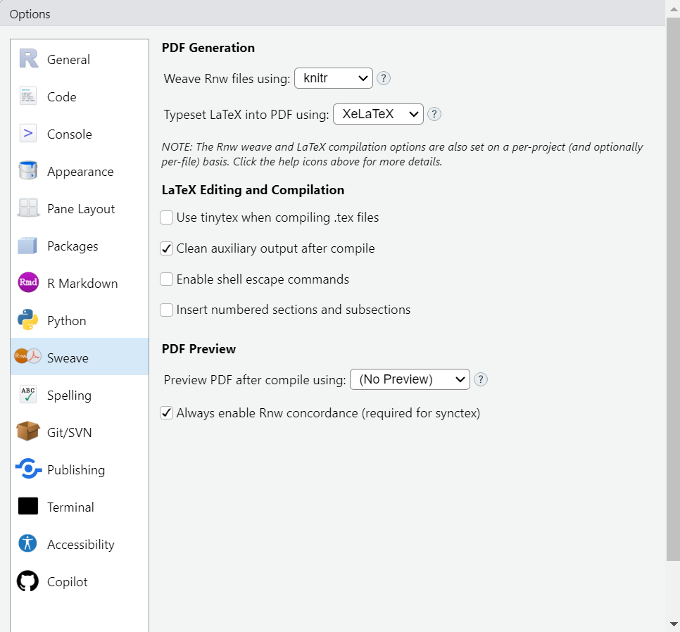

# Easy fix from a fresh R installation (simple way)

You might need to modify some options in Rstudio.

Go to `Tools` -> `Global Options` -> `Sweave` panel, 


Change *Sweave* to *knitr* in the "Weave Rnw files using" drop down menu. Then
change `pdf latex` to `Xelatex`



Then  **click apply**  at the bottom of the window (you need to scroll, it can be
hidden). It will ask you to modify this also for the current project. Do it (it
is the same options). Then **click apply** at the bottom of the window and close
the window. 


Then install the following package in R (type in the Rstudio console)
```{r, eval=FALSE}
install.packages(
  tinytex::install_tinytex()
  )
```


You are ready to test if this work. Create a new markdown document and knit it
as pdf


# Testing or changing the rendering format for your files  

You can try to render a pdf (portable document format), .html (webpage) or .docx (word document) file from an Rmarkdown file (`.Rmd`) by clicking on the `knit` button. 

Which format your document is rendered is determined by the header of your R markdown document. 

```{r, eval=FALSE}
output: pdf_document # for pdf document
output: html_document # for html document
output: word_document # for word document
```


# Going further: installing Pandoc

- [ ] NOT tested yet ! Please tell me if you want to try this. 


[Pandoc](https://pandoc.org/) is a universal document converter, ie: it allows 
to translate / save document from one type eg. Rmarkdown `.Rmd` to another eg. 
word document `.docx` or many other formats, eg. portable document `.pdf`. The 
list of the formats you can convert from and to is given on the pandoc website. 
If you use pandoc alone to convert between types, the conversion of the 
**formatting (how it looks like)** might not be exactly as you wish but it does 
certainly help to go faster in the process.  


Pandoc, when used directly from Rstudio to render your Rmarkdown files 
(`.Rmd` file containing both codes and notes) as a word document (`.docx`) is a 
very powerful tool, because the integration of Rstudio and pandoc is very well 
done.

- [ ] Is this the R package or an adaptation ?
This is an adaptation of pandoc as an R package. 
It is still under development and might not be as complete as the original pandoc
version that you can install as standalone.
 
The description and development website for this package (a github repository) 
can be found  [here](https://github.com/cderv/pandoc)

To install the pandoc package in R, type the following line in Rstudio console:
```{r, eval=FALSE}
install.packages("pandoc")
```

- [ ] ? Choice 2: installation of the stand alone version of pandoc
and check that the path to the pandoc executable is correct.

- download the latest version of the installer for windows from the [pandoc website](https://pandoc.org/installing.html)

The version you have to choose should look like : 
`pandoc-<version>-windows-x86_64.msi`

Then double click on this file to install it, and follow the default instructions
for installation.


- [ ] ? Configuration of Rstudio to produce different file types files with pandoc

You might need to modify some options in Rstudio.

Go to `Tools` -> `Global Options` -> `Sweave` panel, 


Change *Sweave* to *knitr* in the "Weave Rnw files using" drop down menu. Then 
**click apply** at the bottom of the window and close the window. 


<!-- 
- [ ] check : 
https://bookdown.org/yihui/rmarkdown-cookbook/install-pandoc.html
-->

