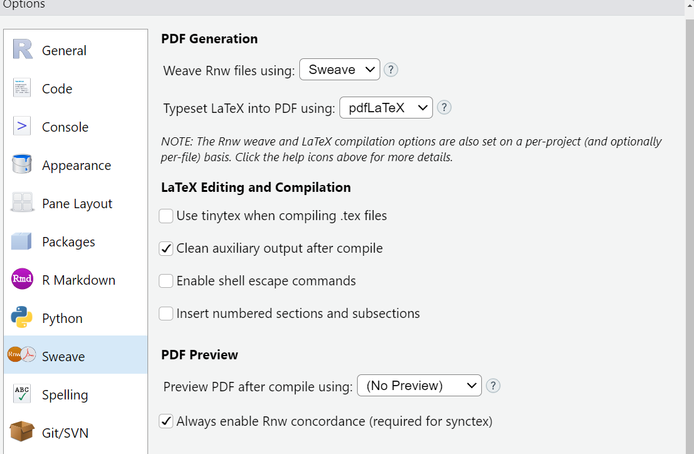

# A note on installation : which version to use ? 

An installer for windows has the **extension (file name ending with)** `.msi`.

- x86 means its a 32 bits windows computers (most older computers)
- x64 means its for a 64 bits windows computers (most recent laptops, and likely the version you should choose when you install software).
- x86_64 is meant for both 32 and 64 bits windows computers

Usually, software versions for 32 bits computer will work on 64 bits computers BUT software version for 32 bits computer will NOT work on 64 bits computers. In doubt, you may choose the 32 bits version. 

Once a software is installed, and can be run, the extension on windows is `.exe` (for executable).

# Installation of pandoc

[Pandoc](https://pandoc.org/) is a universal document converter, ie: it allows to translate / save document from one type eg. Rmarkdown `.Rmd` to another eg. word document `.docx` or many other formats, eg. portable document `.pdf`. The list of the formats you can convert from and to is given on the pandoc website. If you use pandoc alone to convert between types, the conversion of the **formatting (how it looks like)** might not be exactly as you wish but it does certainly help to go faster in the process.  

Pandoc, when used directly from Rstudio to render your Rmarkdown file (`.Rmd` file containing both codes and notes) as a word document (`.docx`) is a very powerful tool, because the integration of Rstudio and pandoc is very well done.

## Choice 1: installation of pandoc via a special R package

This is an adaptation of pandoc as Rpackage. It is still under development and might not be as complete as the original pandoc that you can install as standalone.

The description and development website for this package (a github repository) can be found  [here](https://github.com/cderv/pandoc)


```{r}
install.packages("pandoc")
```
- [ ] check : 
https://bookdown.org/yihui/rmarkdown-cookbook/install-pandoc.html

## Choice 2: installation of the stand alone version of pandoc

- download the latest version of the installer for windows from the [pandoc website](https://pandoc.org/installing.html)

The version you have to choose should look like : `pandoc-<version>-windows-x86_64.msi`

Then double click on this file to install it, and follow the default instructions for installation. 


# Configuration of Rstudio to produce pdf files

You might need to modify some options in Rstudio.

Go to `Tools` -> `Global Options` -> `Sweave` panel, 



Change *Sweave* to *knitr* in the "Weave Rnw files using" drop down menu. Then **click apply** at the bottom of the window and close the window. 

# Testing the render of your files  

You can try to render a pdf (portable document format), .html (webpage) or .docx (word document) file from an Rmarkdown file (`.Rmd`) by clicking on the `knit` button. 

Which format your document is rendered is determined by the header of your R markdown document. 

```{r, eval=FALSE}
output: pdf_document # for pdf document
output: html_document # for html document
output: word_document # for word document
```


and check that the path to the pandoc executable is correct.


<!-- 

# Installation of pdflatex

pdflatex is a tool 
police and fonts ?

(`.pdf`).

Installing pdflatex will allow you to render
your Rmarkdown file as a pdf document (`.pdf`).

--> 
