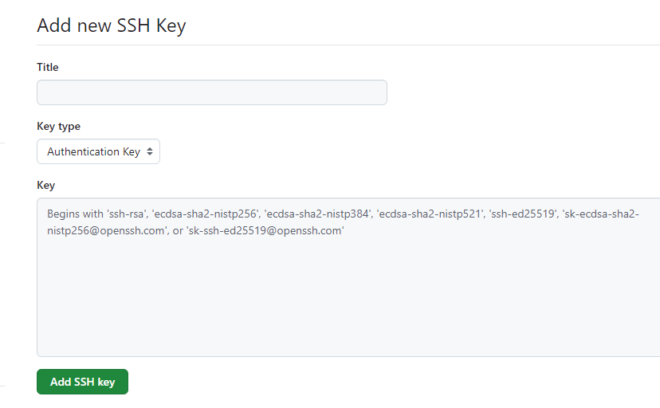

# Download and install git-bash

At [https://git-scm.com/](https://git-scm.com/) and 
follow the instructions for installation 

---

# Create a free account in github

Go to [https://github.com/](https://github.com/) and sign up  

- choose the email address you want to use (it does not need to be your university 
address email; you can use a permanent personal email address, if you want. This 
will allow you to keep access to your account should you leave the university)
- choose a strong password - you can remember (note this somewhere safe)

---

# Create a ssh key on your computer

- this is done using git bash
    - launch git bash (from the windows menu)


  - you get a window like that - its called a terminal
    

    
  - you will write instructions in the terminal - and the computer will execute those
  - `#`  are comments - they are not executed
  - **type the instructions bellow; note: you need to use the same email address 
  than the one you used to create the github account. So: replace** 
    `"your_email@example.com"` by your email.
  - **press enter between each line.**

```bash
# show which directory you are on the computer - copy this path in a notepad file
pwd 

# if you are working on a windows computer please write this command 
git config --global core.autocrlf true # its an additional configuration for the end of lines

# creates a ssh key
ssh-keygen -t ed25519 -C "your_email@example.com"

# press enter at all questions 
# do not fill anything, that will be too complicated for a start
```

This will create a directory called `.ssh` 

```bash
# entering the directory 
cd .ssh

# list the files in the directory
ls -la 
```

You have now two files in the directory - files functioning as pair to allow ssh 
key to authenticate you on cloud services

- `id_ed25519`  which is a private key.  **You should NEVER give this key to 
anyone else, and NEVER upload it anywhere - its stays on your computer**
- `id_ed25519.pub` is a public key. We can upload the content of the public key 
to github.

Those to keys will help identifying you in github, and while using R, without 
you having to type passwords all the time. 

The principle of usage is that if you provide a public key to a cloud service 
(eg. github), it will use this information to authenticate you. 

**A caricature is that: the cloud service will ask your computer if its you 
trying to authenticate. Because your computer possesses the private key that is 
associated to the public key the cloud services has information about, the 
computer will answer YES. So the cloud service will let you in.** 

(This is why you never give your private key to anybody, its stays on your 
computer. If you share it, people will be able to identify as you, and you do 
not want that)   

---

# Add the SSH public key to your github account

You will put the information from the public key in the github account you just 
created 

In git bash get the information of the public key

```bash
cat id_ed25519.pub
# it provides text starting by ssh-ed ... and finishing by your email
```

- logging to your github account
- got to `Settings (your profile > settings)`


- then go to `SSH and GPG keys > SSH keys`


- click `new ssh key`
    - give a name to the ssh key
    - paste the text that is given by git bash for your public key (above)
    - click add ssh key
    - confirm if requested using your password
    


    
- Testing if the ssh key works : in git bash type :

```bash
ssh -T git@github.com
```

say yes … the last line of text should say something like  - your username 
should be written - then you know it works

```bash
Hi <username>! You have successfully authenticated, but GitHub does not provide 
shell access.
```

---

- creating a configuration file (in git bash)
    
```bash
# go to the home directory
cd 
# go to ssh directory
cd .ssh
# creating and opening a config file using a simple text editor : nano
nano config 
```

- Now copy and then paste the following lines (right click) in the file that is 
open.
    - ! if you used a different path and id of the key put that here (it gives 
    the directory and prefix where your key pair is stored)

```bash
Host [github.com](http://github.com/)
Hostname [github.com](http://github.com/)
IdentityFile ~/.ssh/id_ed25519 
```


- NB: The symbol `^` means the touch `ctrl` (no need of capital letters here)
- We save the file using `ctr+O`
    

    

it ask to write config  : this is correct (note this is correct that there is 
no extension) - press enter. It said it wrote 3 lines. 


- Now we close it using  `ctrl+X` - we should return to git bash window. We have 
now a file that is called config


---

NB: 

- If you wish, you can eg. read more on how ssh-keys work here :  [https://www.sectigo.com/resource-library/what-is-an-ssh-key](https://www.sectigo.com/resource-library/what-is-an-ssh-key)
- This tutorial is an extract of the guidelines provided here: [https://docs.github.com/en/authentication/connecting-to-github-with-ssh/generating-a-new-ssh-key-and-adding-it-to-the-ssh-agent](https://docs.github.com/en/authentication/connecting-to-github-with-ssh/generating-a-new-ssh-key-and-adding-it-to-the-ssh-agent)

---

# Create a repository on github

- got back to your main github page


- click on new to create a new repository
- create a new repository (you can choose own name and description - 
we will use for the course - do not have space between words in the repository 
name) and otherwise use the same options I did use


---

# Configure R to use your SSH key and github

- after having installed R and Rstudio (if you did not yet, do so) and the 
previous actions above
- launch Rstudio
- go to `Tools > Global Options > Git/SVN`
    - verify that the path in “Git executable is correct” (mine is 
    `C:/Program Files/Git/bin/git.exe)`
    - verify that the ssh key path is correct(mine is 
    `C:/Users/username/.ssh/id_ed25519`  ), this corresponds to the path 
    shown in git bash
    
```bash
pwd
/c/Users/username/.ssh
```
    
- press apply if you changed something, otherwise : cancel

NB: Here is the new link of R and version control usage (in case) [https://docs.posit.co/ide/user/ide/guide/tools/version-control.html](https://docs.posit.co/ide/user/ide/guide/tools/version-control.html)

---

# 7. Final setup : Making git, github and R work together

Create a directory where you will be able to have your R projects on your PC. 
Example I created one in `Documents` and called it `my_projects`

- right click on `my_projects` and open with “git bash here”


This allows you to open “git bash” in the my_project directory. You can verify 
the path using `pwd` which is path of the working (current) directory. 
(All good. ! )


We will create a directory inside by something that is called “cloning a github 
repository”  - basically we will create a directory that allows to link a 
repository in github (also called remote) to a directory on your local PC 
(origin). 
For now, just let git bash window open

- go to github and look at the repository you created (I called it learning_R). 
It should look like something like that: 


- click on the green code button, go to SSH and copy(the two windows on the right)


- go back to git bash windows that is still opened and type `git clone` then 
paste (right click paste) the instruction you just copied for me it give that, 
and press enter. If it indicates that it received object its all good.


Now you can look you have a sub-directory in `my_projects` - this sub-directory 
has the name of the github repository `learning_R` … and you will be able to 
write your code in this directory with R, and save the code and track changes, 
and this we will learn how to synchronize with github for version control.

Go to the directory. It should contain the following files, and a sub-directory 
called .git (this is the directory that does the version tracking). 


We will have an brief overview of what those files are during the course. 

- now we will create a R project in this sub-directory, so you can write the code 
during the course. Go back to Rstudio, and do  `File > New project` then 
choose `Existing Directory`  and in the explorer choose the directory we just 
created from github `learning_R` for me.


- The click create project.
- Now you can see that you are in the project with this panel


- if you click on [README.md](http://README.md) you will see it contains the 
description that we entered into github.
- You can now close Rstudio for now.

If you managed to reach this stage, well, you already have done the most 
difficult and most boring part alone.  
If not, do not worry, please tell me where you stopped so we can have a look 
during the meeting online.

Back to [Index](index.html)