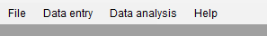
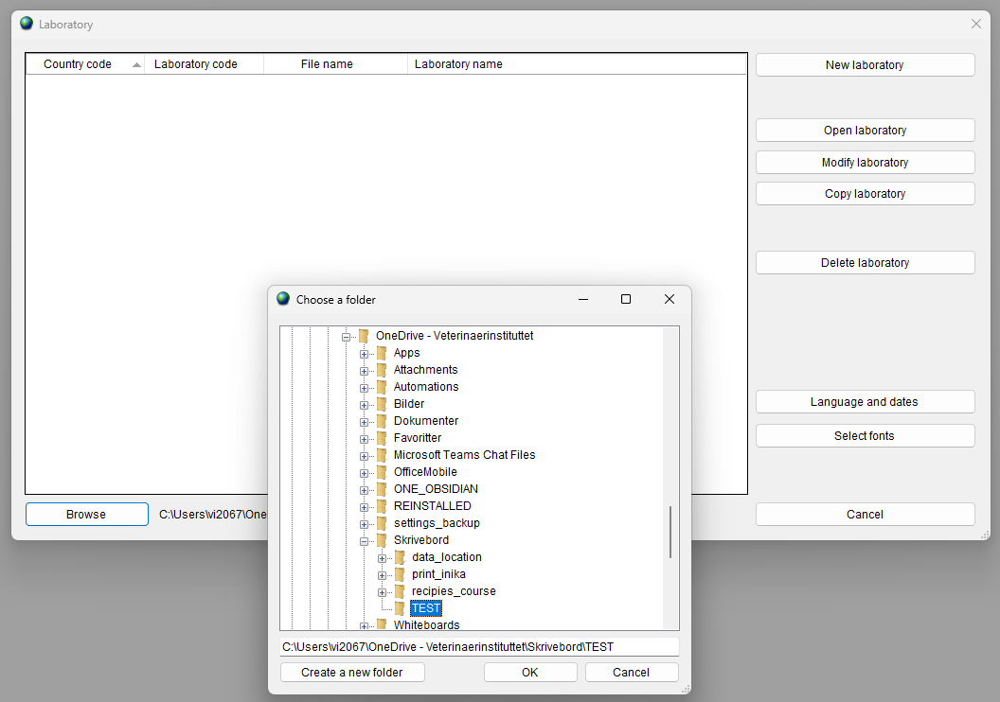
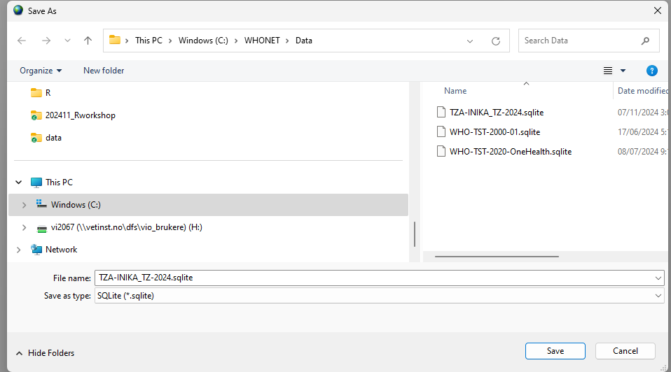
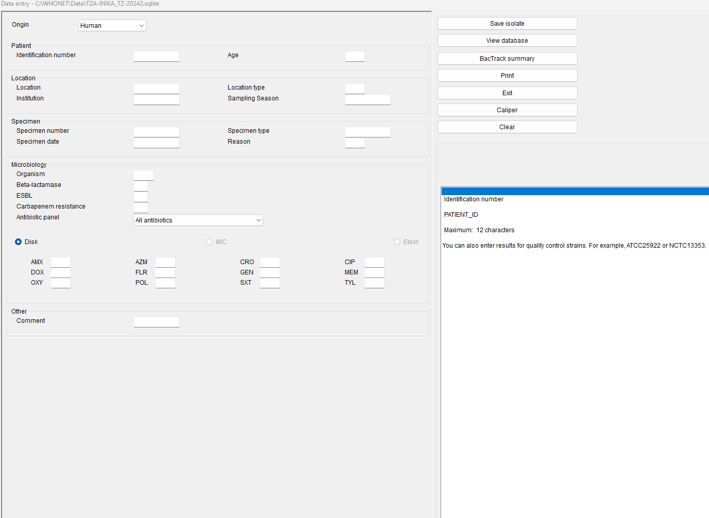
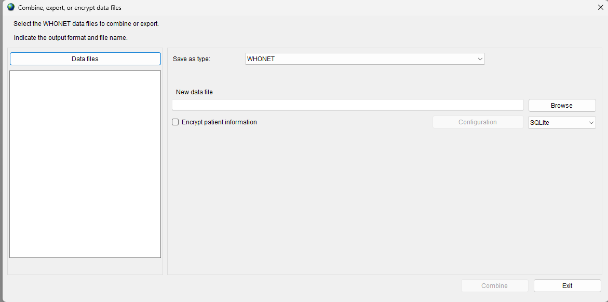
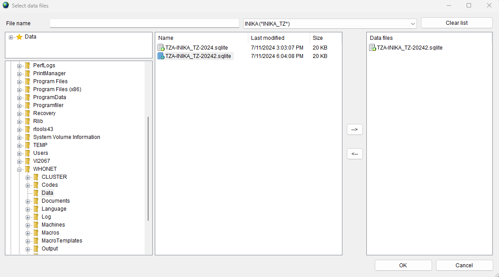

# Installation

Go to [WHONET website](https://whonet.org/) and download the program WHONET 2024. Current laptops are usually use 64 bits version. 

To install the program: double click on the file you just downloaded (its `WHONET2024-Setup-x64-v24.10.22.exe` for me) and use default installation options. 

WHONET offers a lot of tutorials on how to use it via its [Training center](https://whonet.org/training.html). 

During this week, you will learn how to use it to register the data for INIKA project. 
The instruction bellow are specific to get you ready to register data for
the INIKA project.

## Getting ready to enter data for the INIKA project

### Import of the Laboratory file[^1]

[^1]:This needs to be done only once 

Janice has prepared a laboratory file. This file contains information about the data you will have to register. It kinds of create a form for  data registering, similar to the questionnaire form that was used to register data in KoboToolbox.

The laboratory file starts by `LAB` then `TZA` for Tanzania.

> The test version I am using now is called `LABTZA.INIKA_TZ` (you might have to use 
a version that will be named differently)

To import this laboratory into your WHONET_2024 in the menu.  

{width=50%}

Go to `File` (select and one left click),  then choose  `Browse` and find the directory where you have downloaded the laboratory file and select this directory and click ok. 
Then select `Open laboratory`. 

{width=50%}

- [ ] Janice updating breakpoints ?  selected no 

### Create a new data entry

> PS: done only once, the first time you want to register data from a new lab! 

Create a data entry file (this will be a SQLite database) by selecting `Data entry` and then `New data file`.  You can use the default location, but you need to **remember where this is, and you need to note the name of the file.** then click save.

> For me the default location is `C:/WHONET/Data` and the file is called  `TZA-INIKA_TZ-20242.sqlite`. 

A form to register your data will appear. This should look similar to that[^2]: 

When you close the window using `X` (top right of the window) you exit the 
data registering form.

[^2]: It will not be exactly identical, because there are still some discussion about
the field choice and their naming.

# Working with WHONET 

## Entering data

Each time you have closed WHONET, you will reopen the data file you are started
to register the data into.

Select `Data entry`  then `Open data file` and choose the file that you saved in the previous section.

> Enter the data for several isolates (Training session done with Janice). 

The data you registered is saved when you click on `Save isolate`

You can have a look at the data you have registered by clicking on `View database`. This can allow you to have an overview and
correct eventual mistakes during registering, when you are using your lab notes.  

To go **back to the form** for registering data, click on `Continue`

To exit the form click on `Exit`

## Backing up your data

**<mark><b>IMPORTANT :  you data has to be backup regularly and put on a shared directory where we can access it.</b></mark>**
This is important because if there is a problem with your computer, not all your work will be lost. 

Never work more than half a day on data registering without backing up your data

- [ ] Please create a backup of your data in Google drive for INIKA project in the `PhD_AREA directory` in your own sub-directory. We recommend you create a folder named WHONET_data in your own sub-directory where you will deposit the backups. 

### Solution via WHONET 

To create a file containing the backup of your data: 
select `Data entry` then `Combine, export or encrypt data files`

Then click on `Data files`, select the file and use the **arrow directed to the right** to add the file to the `Data files panel` (the left arrow allows to remove this if you have done a mistake)  and click `ok`

The previous panel is now updated. 

- Use `Browse` to choose where you will save the file (it must be easy of access so you can copy this data to your backup area on Google drive)

<u>Naming rules:</u>

Please save the backup using a file name constituted as such : `date_OriginalName.sqlite`

- Type the date (ISO format e.g.. `2024-11-07`) . If you really want hours minutes and seconds, do: `2024-11-07_18-15-00` Unless you export your data several times a day I do not think its necessary. 
> This is a deviation from ISO format, but it will work for a computer file exported at 18h 15min 0s.

- The original name of my file is `TZA-INIKA_TZ-20242.sqlite` 
- The final name is then `2024-11-07_TZA-INIKA_TZ-20242.sqlite`

Then click on `Combine` (we do not combine data but this allows exporting the data)
Then click on `Exit`

**Then you will need to upload this file on INIKA Google drive to your backup area.**

### Solution via file explorer 

- Find where the data from WHONET data is registered. For me it is registered 
in `C:/WHONET/Data` and the original WHONET file is called `TZA-INIKA_TZ-2024.sqlite`
- copy (`ctrl + C`) or right click with the  mouse
- Navigate to the backup save location save location 
- paste (`ctrl + V`) or right click paste with the mouse
- rename the file according to the naming rules described above, it should according to my example be `2024-11-07_TZA-INIKA_TZ-20242.sqlite`

**Then you will need to upload this file on INIKA Google drive to your backup area.**

# Changing LAB configuration

## Aggreement with NVI team before changing LAB configuration

Should you need (maybe at the beginning of data registering AND 
**in agreement with the teams members (Janice & Camilla)**
during meetings, you may have to replace the original lab
configuration by another one. This is a file that Janice will provide.

**BEFORE** you replace the lab file with a new one, you need to delete the old one.
Either directly, using WHONET OR you can delete the file via _windows file manager_. 
The file is in `C:/WHONET` and starts by `LAB`eg . `LABTZA.INIKA_TZ`

Then you can import the new lab file as described in the first section of this 
document.

## Reopening the data 

**BEFORE reopening the data file after a change of lab configuration, you MUST
backup the data file in Google drive, including the date (and eventually time)
of the backup!, even if you did a backup just before.**

Then you can open the data that was created with the previous lab configuration.
It might ask you to remove or make some change. **If WHONET software asks
you to remove columns that
contain important information, you should have discussed this with the INIKA 
team members at NVI. If this has not been discussed, this is not good. Please
take this up with the team members.**

Back to [Index](index.html)